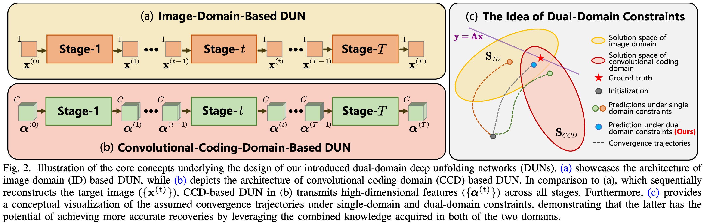

<div align="center">
<h3>(TCSVT 2024) D3C2-Net: Dual-Domain Deep Convolutional Coding Network for Compressive Sensing
</h3>


[](https://ieeexplore.ieee.org/document/10520309) 

[Weiqi Li](https://scholar.google.com/citations?user=SIkQdEsAAAAJ), [Bin Chen](https://scholar.google.com/citations?user=aZDNm98AAAAJ), Shuai Liu, Shijie Zhao, [Bowen Du](https://scholar.google.com/citations?user=AqK633EAAAAJ), Yongbing Zhang and  [Jian Zhang](https://jianzhang.tech/)

*School of Electronic and Computer Engineering, Peking University*
</div>

Accepted for publication as a Regular paper in the IEEE Transactions on Circuits and Systems for Video Technology (TCSVT).

## Core Ideas



## Environment

```shell
pip install -r requirements.txt
```
## Train
Download the dataset of [Waterloo Exploration Database](https://kedema.org/project/exploration/index.html) and put all images in the `pristine_images` directory (containing 4744 `.bmp` image files) into `./data/train`, then run:

```
CUDA_VISIBLE_DEVICES=0 torchrun --nproc_per_node=1 --master_port=35001 train.py --phase_num 25 --learning_rate 1e-4 --batch_size 8
```

The log and model files will be in `./log` and `./model`, respectively.

## Test

The model checkpoint file is provided in `./model`, and the test sets are in `./data`.
```
python test.py
```

## Supplementary Materials

We provide theorem proof and more applications of D3C2-Net in [supplementary materials](
https://ieeexplore.ieee.org/ielx7/76/4358651/10520309/supp1-3397012.pdf?arnumber=10520309).


## Citation
If you find the code helpful in your research or work, please cite the following paper:
```
@article{li2024d3c2,
  title={D3C2-Net: Dual-Domain Deep Convolutional Coding Network for Compressive Sensing},
  author={Weiqi, Li and Bin, Chen and Shuai, Liu and Shijie, Zhao and Bowen, Du and Yongbing, Zhang and Jian, Zhang},
  journal={IEEE Transactions on Circuits and Systems for Video Technology (TCSVT)},
  year={2024},
  volume={34},
  number={10},
  pages={9341-9355},
  publisher={IEEE}
}
```
